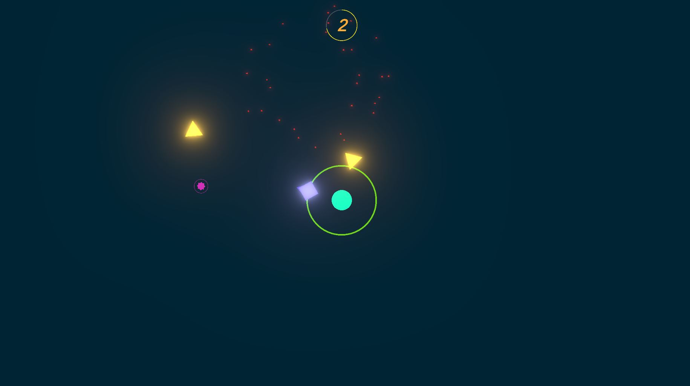
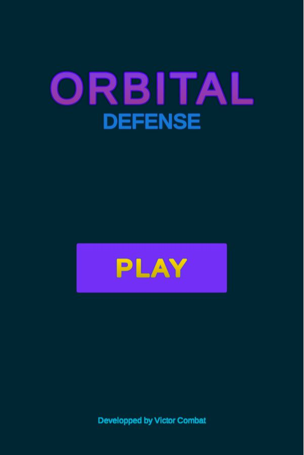
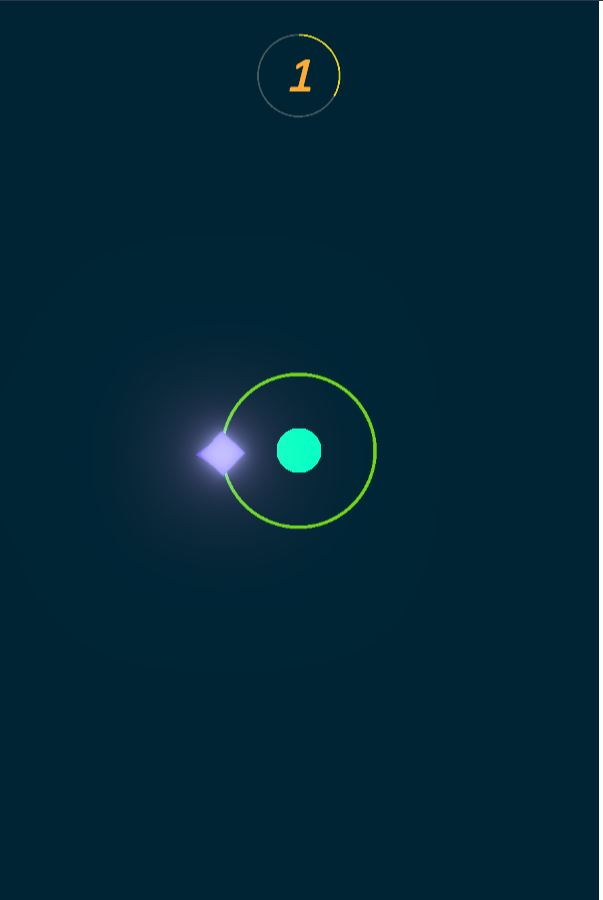
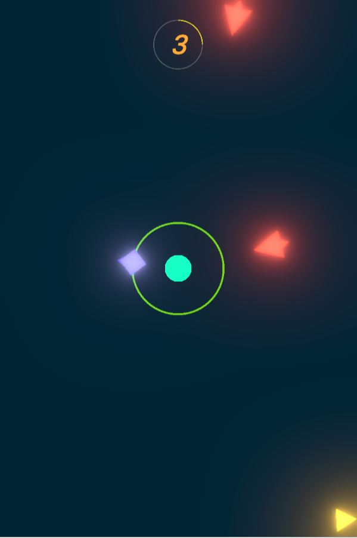
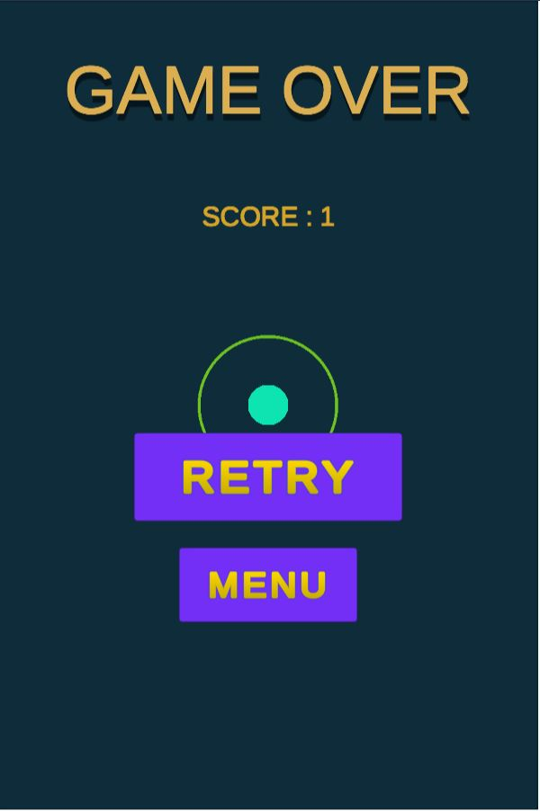

  

  <h1 align="center"> Orbital Defense </h1>

  

     
    <a href="#about-the-project">About the project</a>
    ·
    <a href="#built-with">Built With</a>
    ·
    <a href="#main-features">Main Features</a>
    ·
    <a href="#gallery">Gallery</a>
    .
    <a href="#contact">Contact</a>
     
     
    
  
  
  

 

<!-- ABOUT THE PROJECT -->
## About the project

Orbital Defense is a small 2D arcade-infinite-shooter game made with Unity.

As I was learning Unity by my own, I wanted to challenge myself to make a game in a week to see what I could do.
The design and development of Orbital Defense was born from this challenge.

### Demo

A demo is available [here](https://victorcombat.com/orbital-defense/index.html).

<!-- BUILT WITH -->
## Built With

* [Unity](https://unity.com/)

<!-- MAIN FEATURES -->
## Main Features

   | 
 Features 
                           | Status                    |
   | :---                                                                 |           :---:           |
   | Shoot & destroy enemies to score                                     |     :white_check_mark:    |
   | Pick up some power-ups                                               |     :white_check_mark:    |
   | Different enemies archetypes                                         |     :white_check_mark:    |
   | Bloom effect                                                         |     :white_check_mark:    |
   | Camera shaking effect & particles spawning when destroying enemies   |     :white_check_mark:    |

## Gallery

  
 Show gallery 

          
  
  

<!-- CONTACT -->
## Contact

  
  
  

##

  

